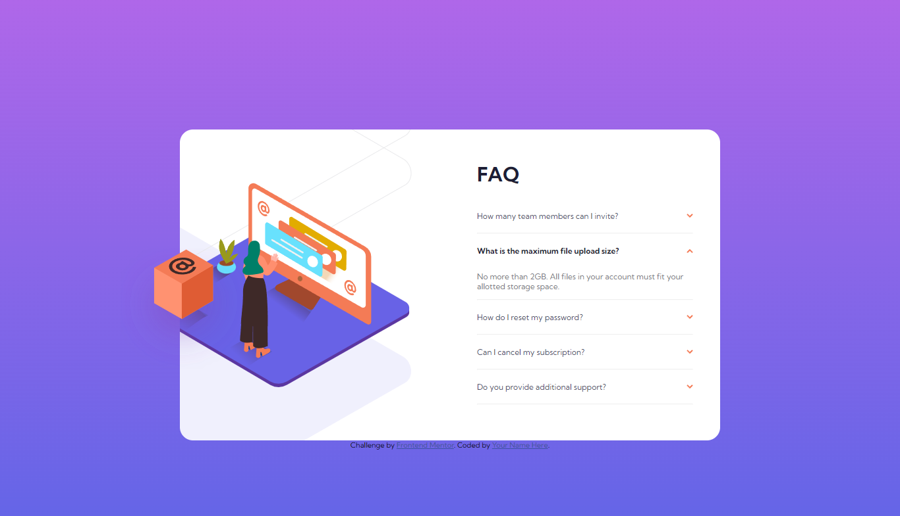

# Frontend Mentor - FAQ accordion card solution

This is a solution to the [FAQ accordion card challenge on Frontend Mentor](https://www.frontendmentor.io/challenges/faq-accordion-card-XlyjD0Oam). Frontend Mentor challenges help you improve your coding skills by building realistic projects. 

## Table of contents

- [Overview](#overview)
  - [The challenge](#the-challenge)
  - [Screenshot](#screenshot)
  - [Links](#links)
- [My process](#my-process)
  - [Built with](#built-with)
  - [What I learned](#what-i-learned)
- [Author](#author)

## Overview

### The challenge

Users should be able to:

- View the optimal layout for the component depending on their device's screen size
- See hover states for all interactive elements on the page
- Hide/Show the answer to a question when the question is clicked

### Screenshot



### Links

- Solution URL: [Add solution URL here](https://your-solution-url.com)
- Live Site URL: [Add live site URL here](https://your-live-site-url.com)

## My process

### Built with

- Semantic HTML5 markup
- CSS custom properties
- Flexbox
- CSS Grid
- Mobile-first workflow

### What I learned
 
I'd always thought it was neccessary to integrate javascript or use some extra DOM nodes for css functionality when making an accordion such as this one. 
I learned while making this project that this is possible with just HTML. 
Now I can replicate this in the future without having to add unnecessary nodes to the DOM or using a CSS hack like the checkbox hack. 

```html
  <details class="faq">
        <summary class="question">
          <p>
          How many team members can I invite?
          </p>
          
        </summary>
        <p class="answer">
          You can invite up to 2 additional users on the Free plan. There is no limit on team members for the Premium
          plan.
        </p>
      </details>
```

## Author

- Frontend Mentor - [@exploitenomah](https://www.frontendmentor.io/profile/exploitenomah)
